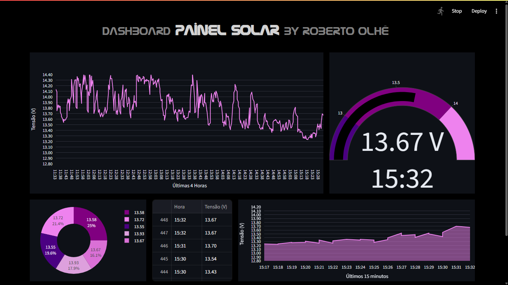
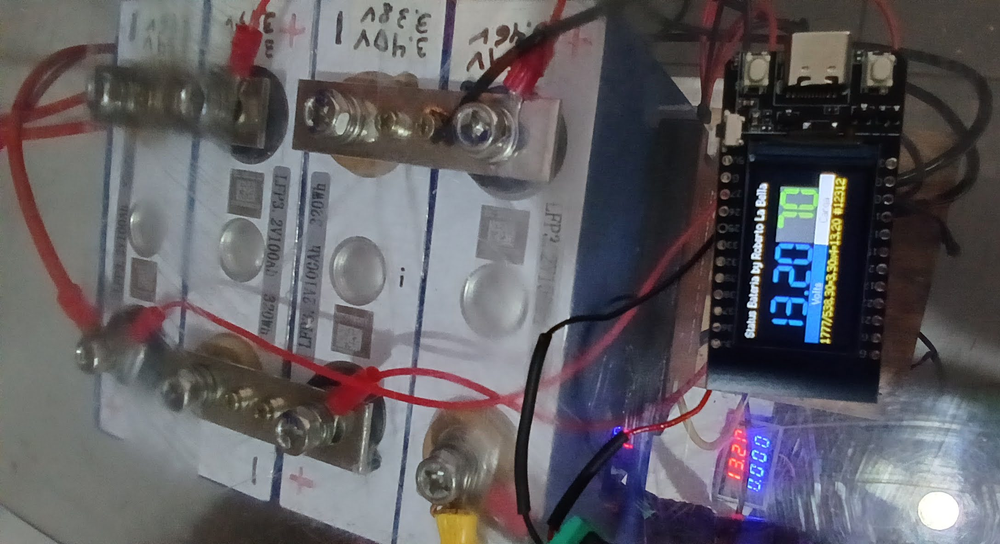

# painelsolardoroberto
Dashboard PAINEL SOLAR Sistema de Monitoramento Solar Fotovoltaico - by Roberto La Bella Olhê (github.com/robertoolhe)

Consegui vencer o desafio de fazer um DashBoard em Python que atualiza a cada 1 minuto, de graça. Já que o PowerBI só permitia umas 8 atualizações por hora kkk. São 60 atualizações automáticas por hora, 1.440 por dia! Obtidas pelo sensor da TT-GO T-Display ou do Arduino e armazenadas no banco de dados em Planilha do Google Sheets PostgreeSQL(em substituição ao PostgreSQL Neon Tech em nuvem, pois após 190h de uso seria pago! )

Mas tive que aprender muita coisa, por exemplo, usar:

01) Esp32 da TT-GO T-Display e porta analógica GPIO34 (vbat) programando em MicroPython e usando a lib TFT-eSPI, ou ESP8266 Wemos D1 R1 usando um Sensor de Tensão (divisor)
02) Neon Tech PostgreSQL (PG cloud) e me aprofundar em SQL, cloud, PG e timestamp e depois API Service Client Google Sheets com ESP32/8266 para poder gravar gratuitamente indefinidamente sem o limite de 190 horas do PostgreSQL Neon Tech, preferi sem limite de gravação ou acesso do Google Sheets e gratuito
03) VS Code c/sweet drácula, git e bash
04) Python 3.13 
05) Bibliotecas SQLAlchemy, psycopg2, plotly.express e go, pandas e streamlit
06) Streamlit
07) MarkDown (para os títulos)
08) GitHub para repositório público
09) Git para versionamento
10) GithubCLI para usar branchs
11) Git Bash e Venv para Deploy no SL
12) Deploy no Streamlit
13) Secrets no Arduino WiFi e na API GSheets e no Streamlit
14) Transformar um Notebook velho em um Painel LCD invertido para exibição do Painel Solar em tempo real 24h (alimentado pelas baterias LifePo4, ou seja, sem gastar energia, assim como vários outros equipamentos em casa: lâmpadas, ventiladores, notebooks, luz noturna, etc, em breve Cooktop por Indução para economizar Gás de Cozinha com o adicionamento de um Banco de Supercapacitores ao Sistema)

PS: E ainda descobri uma restrição no Streamlit que só fez o Deploy quando subi psycopg2-binary no lugar de psycopg2, leia o meu requirements.txt para conferir.

Para mim é um hobby gratificante (que ainda gera economia de luz em casa com os painéis solares do 'portão solar' que eu mesmo inventei e fiz - vide fotos abaixo), mas há uma boa demanda para desenvolvedores de Dashboard para Gestão de e-commerces, financeiras, setor público, fintechs e outras que precisam acompanhar em tempo real seus sistemas/vendas e o meu é um dos primeiros que integra sensores em tempo real que teria excelentes aplicações nas indústrias substituindo caríssimos sistemas de CLP (automação robótico-mecatrônica) ou de gestão de equipamentos/linhas de produção em tempo real, por exemplo acompanhando a temperatura de um forno que nunca pode desligar ou abaixar muito a temperatura, ou quaisquer sistemas industriais que podem usar sensores: de tensão, corrente, temperatura, aproximação, peso, vibração, inclinação, fluxo, decibéis (sons/ruídos), tráfego com IA, rpm, lux, cor, velocidade, quantidades (por exemplo quantos itens passam numa esteira), e uma infinidade de controles.

Meu github:
 https://www.github.com/robertoolhe (Roberto La Bella)

FOTOS:

